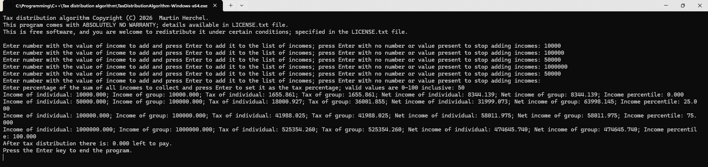

# Tax distribution algorithm

Tax distribution algorithm is a tax distribution algorithm for income tax based on my vision of what a tax distribution algorithm — and taxes — should accomplish, which runs in your command prompt.

## Tax distribution ideology

The algorithm is based on these values:
* A person with a smaller income pays less taxes than a person with a bigger income
* A person with a bigger income pays more taxes than a person with a smaller income
* A person with a bigger income has a bigger net income than a person with a smaller income
* People with identical incomes have identical taxes; identical net incomes

## Algorithm for calculating taxes

The incomes are sorted from lowest to highest; a previous group of identical incomes has a smaller individual income than a current group of identical incomes and vice versa.

The incomes are grouped into groups based on identical income values — **income groups**.

The **income groups** are processed from the smallest individual income to the highest individual income.

A **ratio** is the result of smaller value divided by bigger value. A **reverse ratio** is the result of 1 - **ratio**. 

The tax of a specific income — which will be then used as a **ratio** to determine the final tax — is calculated, in part, based on these factors:
- The **ratio** of the percentile of the start of the **income group** out of the percentile of the highest **income group**; if the last percentile is 0 the **ratio** is set to 1 — the last percentile is 100 only if there is only one person with the highest income
- The **reverse ratio** of the percentile of the previous **income group** to the percentile of current **income group**; if the current percentile is 0 the **reverse ratio** is set to 0
- The **ratio** of the individual income in the current **income group** to the individual income in the highest **income group**; if the highest individual income is 0 the **ratio** is set to 0
- The **reverse ratio** of the individual income of the previous **income group** to the individual income in the current **income group**; if the current individual income is 0 the **reverse ratio** is set to 0 

The formula for calculating a tax for an individual income, which is then used as a **ratio** that is then used for calculating the actual tax = `tax of an individual in a previous income group + (an average of the 4 previously listed ratios and reverse ratios * (the highest acceptable tax for an individual to still have as much net income as an individual in a previous income group - tax of an individual in a previous income group))`

This tax — or more appropriately **ratio**, as that is how it's used — is then divided by the sum of all taxes paid by the income groups to get the **ratio** to all of the taxes, that were paid. That **ratio** is then multiplied by the total tax to be paid — which is the percentage of the sum of all incomes. This is done for all **income groups**.

After all these steps the algorithm is complete and the results are output to the console. 

Despite me — informally — proving that this works it has very slight issues — at least they were slight in my testing — where there is very a slight overpaying or underpaying of the taxes; this is underpaying or overpaying is so small that a scientific notation is used to display its value; as far as I know — and as far as it makes sense to me — this cannot be simply solved as this is a technological limitation; the numbers use a limited part of memory that may not be sufficient, because the number may be infinite or at the very least bigger than memory in which they are held; this issue isn't addressed in the algorithm — at least so far; I don't see it as a significant enough issue for the performance trade-off as well as the potential issue of never getting to a pure 0 — even within the memory limitations; this should not be seen in the output as the output is limited to 3 numbers after the decimal separator.

## Features

Currently this program supports the following features:

- Inputting incomes — numeric values — one at a time
- Outputting the results of running the algorithm into the console 

## How to use

- The software has multiple releases you can use, if your release isn't listed here you can build it for you computer by following the instructions in the [How to build it yourself from source code](#how-to-build-it-yourself-from-source-code) section. The available releases are: 
	- For 64 bit operating systems with x64 based processors:
 		- Linux Mint — specifically 22.3
 		- Windows 11.
- Get the files:
	- For **Linux**: Download the `TaxDistributionAlgorithm-Linux-x64.zip` file from the release you wish to use — all the available releases are listed [here](https://github.com/Rudolf-Snail/Tax-distribution-algorithm/releases/)
	- For **Windows**: Download the `TaxDistributionAlgorithm-Windows-x64.zip` file from the release you wish to use — all the available releases are listed [here](https://github.com/Rudolf-Snail/Tax-distribution-algorithm/releases/)
- Extract the contents of installed zip file into a folder you want; the program is portable and doesn't support or need installation.
- Check if you have gcc installed:
	- For **Linux**: Open the terminal and type `gcc --version` and `g++ --version` if it returns a text with which version you have, you have it. For best chances of success use the latest gcc version.
	- For **Windows**: Open the command prompt and type `gcc --version` and `g++ --version` if it returns a text with which version you have, you have it. For best chances of success use the latest gcc version.
- If you don't have it, install it by follow the instructions pointed to by these links:
	- [**For Linux**](https://www.geeksforgeeks.org/installation-guide/how-to-install-gcc-compiler-on-linux/)
	- [**For Windows**](https://code.visualstudio.com/docs/cpp/config-mingw#_installing-the-mingww64-toolchain) — note: for installing it on Windows only following the section `Installing the MinGW-w64 toolchain` of the webpage pointed to by the link is necessary.
- If you pass the requirements listed above you can run the program: 
	- For **Linux**: Run the `TaxDistributionAlgorithm-Linux-x64.exe` file
	- For **Windows**: Run the `TaxDistributionAlgorithm-Windows-x64.exe` file
- Follow instructions in the program.

## How to build it yourself from source code

1. Install gcc — ideally the latest version — if you don't have it.
	- For **Linux**: follow the instructions on [this webpage](https://www.geeksforgeeks.org/installation-guide/how-to-install-gcc-compiler-on-linux/)
	- For **Windows**: follow the instructions on [this webpage](https://code.visualstudio.com/docs/cpp/config-mingw#_installing-the-mingww64-toolchain)
2. Navigate to `Tax distribution algorithm` in your command line.
3. Run the command `g++ -std=c++23 ./main.cpp -o nameOfTheExecutableFile.exe`. More information on the command is available [here](https://gcc.gnu.org/onlinedocs/gcc-15.2.0/gcc/C_002b_002b-Dialect-Options.html).
4. Your compiled program is now in the `Tax distribution algorithm` folder under the name `nameOfTheExecutableFile.exe` or the name you chose.

## Contact

You may contact me at: [martinherchel03@gmail.com](mailto:martinherchel03@gmail.com).